# PharmaTech Showcase

Public showcase repository for the **PharmaTech** project.

## At A Glance

**PharmaTech** is a full-stack pharmaceutical equipment platform that combines product showcase, quotation workflow, online purchasing, service request handling, recruitment management, and admin analytics in one system.

- Project type: Team-based academic eProject / semester 3 showcase
- My role: Full-stack contributor focused on feature integration, customer-facing flows, admin modules, deployment support, and production/demo issue fixing
- Main stack: Angular, NestJS, MongoDB, Socket.IO, Stripe, OCR, AI integration
- Live demo: [http://103.153.72.209:4201/](http://103.153.72.209:4201/)
- Demo video: [YouTube walkthrough](https://www.youtube.com/watch?v=Zsyu2Iy9UbY)
- Recognition: [Featured by Aptech Vietnam](https://aptechvietnam.com.vn/san-pham-hoc-vien/do-an-pharmaceutical-giai-phap-chuyen-doi-so-cho-nganh-thiet-bi-duoc-pham/)

## Quick Links

- [Overview](#overview)
- [My Contributions](#my-contributions)
- [What Makes This Project Notable](#what-makes-this-project-notable)
- [Live Links](#live-links)
- [Highlights](#highlights)
- [Tech Stack](#tech-stack)
- [Deployment Workflow](#deployment-workflow)
- [Recognition](#recognition)
- [Screenshots](#screenshots)
- [System Flow](#system-flow)
- [Repository Structure](#repository-structure)
- [Private Source Code Note](#private-source-code-note)
- [Supporting Documents](#supporting-documents)

## Overview

PharmaTech was built to help a pharmaceutical equipment business present its machines, receive customer inquiries, manage purchase and service workflows, and support recruitment activities through a unified digital platform.

The system combines both a customer-facing website and an admin-facing back office:

- Customers can browse capsules, tablets, liquid-filling machines, and related industrial equipment.
- Users can submit quote requests, add products to cart or wishlist, place orders, upload payment proof, and track order progress.
- Job seekers can create accounts, update profile and resume data, save jobs, and apply for open roles.
- Admin users can manage products, categories, stock, orders, returns, recruitment, contact content, support channels, and analytics dashboards.

This public repository is designed for recruiters, interviewers, and reviewers who want to quickly understand the project without being given access to the private production source code.

## My Contributions

- Built and refined major customer-facing pages, including home, shop, product detail, service, career, contact, and account flows
- Worked on admin-side modules related to products, orders, stock, quote management, content management, and recruitment workflows
- Supported frontend/backend integration across product, order, quote, service, career, and chat modules
- Handled deployment-related setup, GitHub Actions CI/CD flow, server publishing, and post-deploy issue fixing
- Investigated and fixed production/demo issues related to assets, environment config, APIs, and online deployment behavior
- Organized recruiter-facing documentation and showcase materials for easier project presentation

## What Makes This Project Notable

- Product catalog focused on pharmaceutical manufacturing equipment instead of generic e-commerce products
- Combined commercial workflow: quote, order, deposit, Stripe payment, payment proof upload, admin approval, and return handling
- Recruitment workflow with candidate profile, resume upload, application tracking, and analytics dashboard
- Admin operations for products, stock, orders, content, contact, quote, support, and service pages
- AI chat and OCR-assisted admin capabilities integrated into the backend
- Real-time communication using WebSocket / Socket.IO
- CI/CD deployment pipeline using GitHub Actions, PM2, and Nginx on a cloud VPS

## Live Links

- Live Demo: [http://103.153.72.209:4201/](http://103.153.72.209:4201/)
- Project Demo Video: [https://www.youtube.com/watch?v=Zsyu2Iy9UbY](https://www.youtube.com/watch?v=Zsyu2Iy9UbY)
- Featured Project Article: [https://aptechvietnam.com.vn/san-pham-hoc-vien/do-an-pharmaceutical-giai-phap-chuyen-doi-so-cho-nganh-thiet-bi-duoc-pham/](https://aptechvietnam.com.vn/san-pham-hoc-vien/do-an-pharmaceutical-giai-phap-chuyen-doi-so-cho-nganh-thiet-bi-duoc-pham/)

## Highlights

- Customer storefront with dynamic product listing, product detail pages, category browsing, wishlist, and cart
- Quote request system with admin review and reply workflow
- Service and purchase request pages for consulting, support, upgrade, maintenance, and B2B process presentation
- Checkout, deposit handling, Stripe payment, payment proof upload, and order approval flow
- Order history, order details, return request, and approval tracking
- Product stock management, QR support, and Excel export workflows on the admin side
- Recruitment dashboard with charts for applications, age range, gender distribution, and top skills
- Admin content management for About, Contact, Homepage, Hotline, Banner, and service/purchase pages
- OCR endpoint and AI chat endpoint integrated into the backend

## Tech Stack

- Frontend: Angular, TypeScript, PrimeNG, Chart.js, Highcharts, Socket.IO client, ngx-quill
- Backend: NestJS, TypeScript, MongoDB, Mongoose, JWT, Passport, Socket.IO, Stripe, Nodemailer
- AI / OCR: OpenAI integration, OCR processing workflow
- Tooling: npm, Git, GitHub, GitHub Actions
- Deployment: Nginx, PM2, VPS server
- Database: MongoDB Atlas / MongoDB Community during development

More detail: [docs/deployment/tech-stack.md](docs/deployment/tech-stack.md)

## Deployment Workflow

- The project uses GitHub Actions for deployment automation
- On push to the `main` branch, the workflow builds both frontend and backend artifacts
- The frontend Angular build is packaged and uploaded to the server for Nginx publishing
- The backend NestJS source is packaged, deployed to the VPS, installed, rebuilt, and restarted with PM2
- The deployment flow keeps the live demo updated without exposing the full private source repository

## Recognition

- PharmaTech was featured by Aptech Vietnam as a representative student pharmaceutical digital transformation project
- Public article: [Dự án Pharmaceutical - giải pháp chuyển đổi số cho ngành thiết bị dược phẩm](https://aptechvietnam.com.vn/san-pham-hoc-vien/do-an-pharmaceutical-giai-phap-chuyen-doi-so-cho-nganh-thiet-bi-duoc-pham/)

## Screenshots

### Home Hero

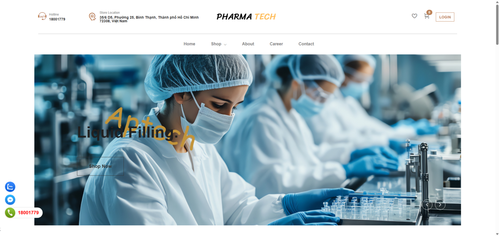

### About Page

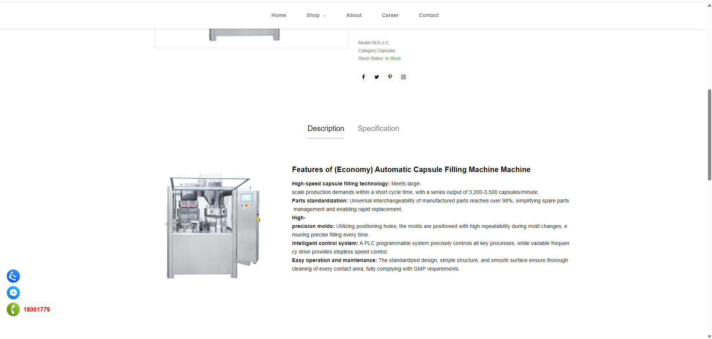

### Product Detail

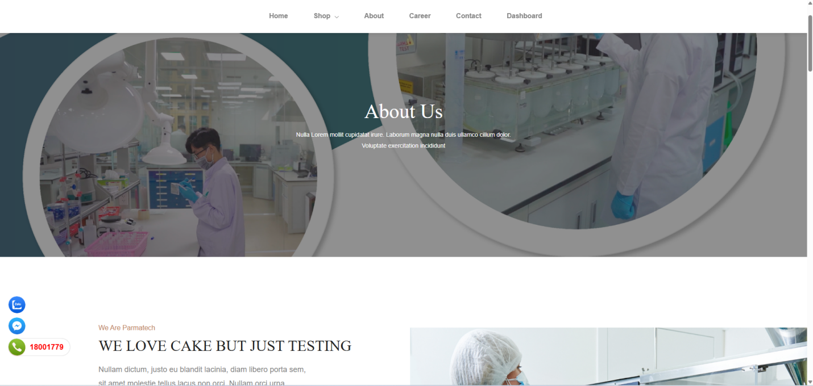

### Service Page

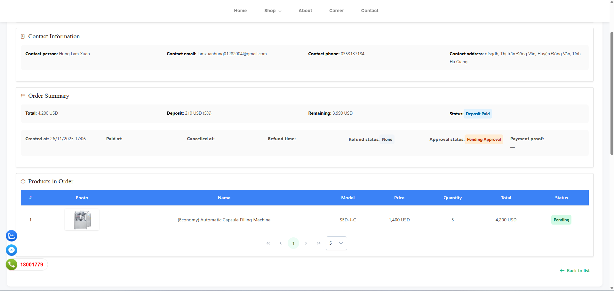

### Quote Management

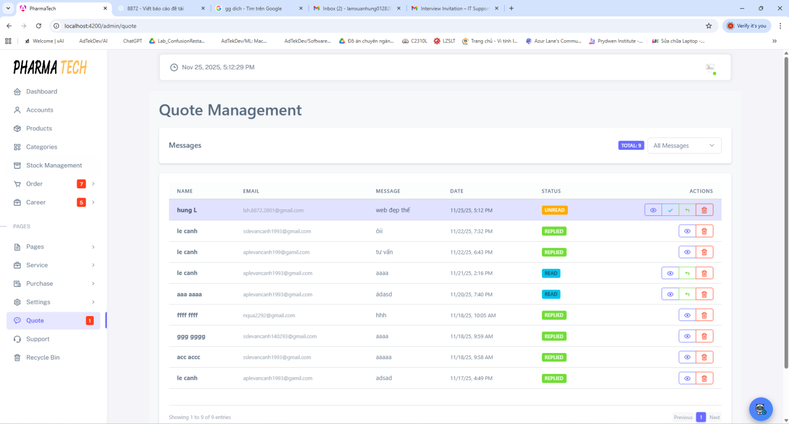

### Admin Order History

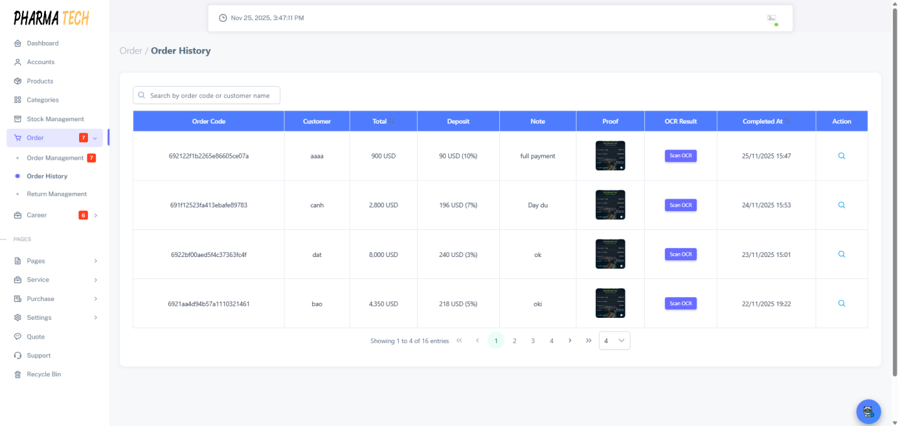

### Recruitment Analytics Dashboard

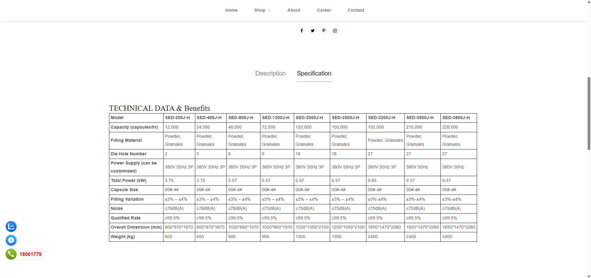

## System Flow

The full interactive system flow is available in:

- [system-flow.html](system-flow.html)

GitHub can also render the Mermaid diagrams directly in this README.

### Authentication Flow

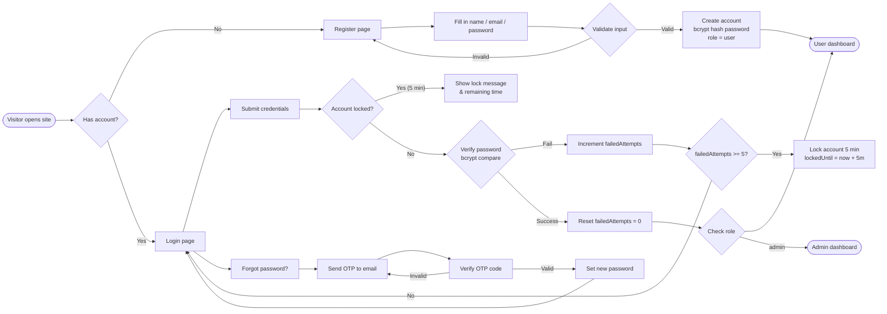

### Customer Shopping Flow

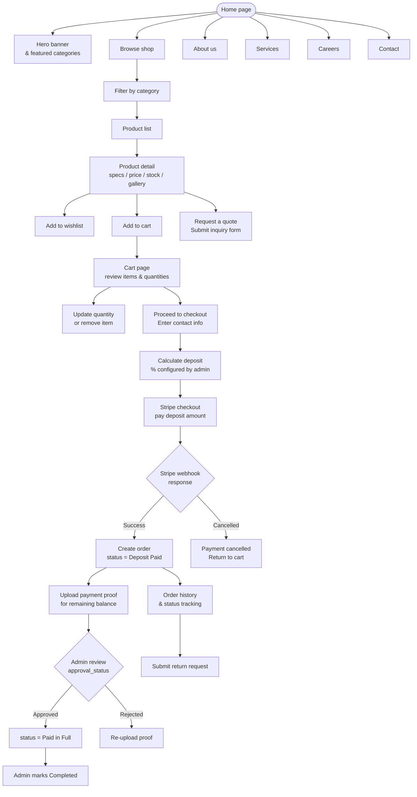

### Order Lifecycle

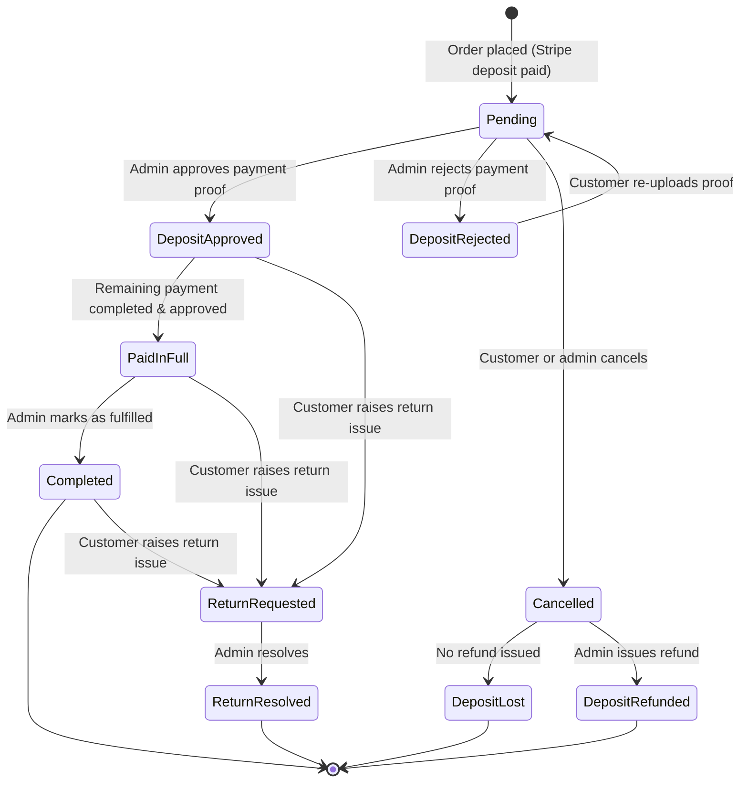

### Recruitment And Career Flow

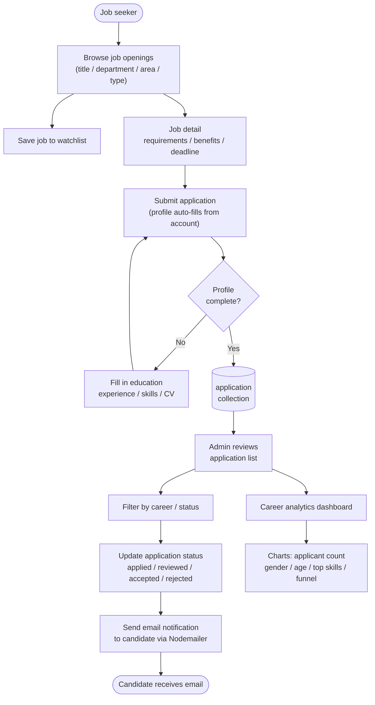

### B2B Purchase Workflow

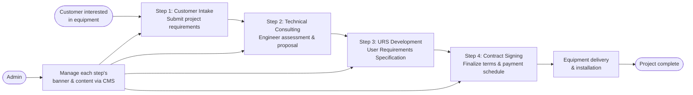

### Admin Management Overview

```mermaid
flowchart TD
    DASH([Admin Dashboard]) --> ACCT["Account Management
view / lock / unlock users
create admin accounts"]
    DASH --> PROD["Product Management
CRUD / main image / gallery
soft delete / recycle bin"]
    DASH --> CAT["Category Management
CRUD / assign to products"]
    DASH --> STOCK["Stock Management
QR code scan / update qty
export Excel"]
    DASH --> ORDM["Order Management
approve / reject proofs
mark completed
view all orders"]
    DASH --> RETM["Return Management
review return requests
resolve & close"]
    DASH --> CARM["Career Management
post / edit job listings
set deadlines & requirements"]
    DASH --> APMM["Application Management
review CVs / update status
send email feedback"]
    DASH --> QUOTM["Quote Management
read inquiries
reply by email"]
    DASH --> SUPP["Support Chat
real-time chat with customers
AI assistant for auto-reply"]
    DASH --> CONT["Content Management
About / Contact / Banner
Hotline / Home categories"]
    DASH --> SRVM["Service Pages CMS
Consulting / Support / Upgrade
Maintenance content"]
    DASH --> SETT["System Settings
deposit % configuration"]

    PROD --> EXPXL["Export product list
to Excel (.xlsx)"]
    STOCK --> QR["Generate QR code per product
scan to update inventory"]
    ORDM --> OCR["OCR scan payment proof
auto-extract amount & date"]
    SUPP --> AI["OpenAI chatbot
context-aware responses"]
    APMM --> CARANALYTICS["Analytics dashboard
applicant funnel / skills / demographics"]
```

### Real-Time Communication And AI

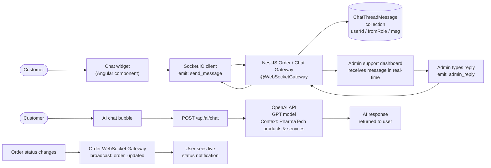

### Payment Flow

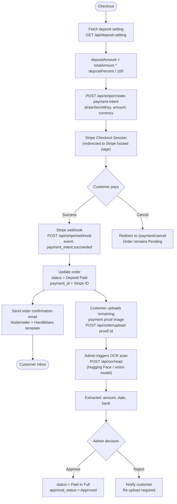

### Database Relationships

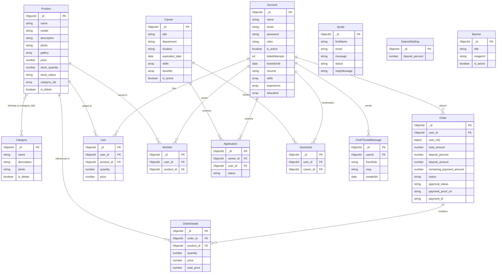

### CI/CD Deployment Flow

```mermaid
flowchart LR
    DEV([Developer]) --> |"git push main"| GH["GitHub
main branch"]
    GH --> |"trigger"| GHA["GitHub Actions
.github/workflows/deploy.yml"]

    GHA --> BUILD_BE["Build backend
npm run build (NestJS → dist/)"]
    GHA --> BUILD_FE["Build frontend
ng build (Angular → dist/)"]

    BUILD_BE --> ARCHIVE_BE["Create backend archive
pharmatech-source.tar.gz"]
    BUILD_FE --> ARCHIVE_FE["Create frontend archive
pharmatech-frontend.tar.gz"]

    ARCHIVE_BE --> RSYNC["rsync archives
to VPS via SSH"]
    ARCHIVE_FE --> RSYNC

    RSYNC --> SCRIPT["Run deploy_server.sh
on production VPS"]
    SCRIPT --> EXTRACT["Extract archives
to /var/www/pharmatech/"]
    EXTRACT --> INSTALL["npm install
(backend dependencies)"]
    INSTALL --> PM2["PM2 restart backend
process: pharmatech-api
port 3000"]
    EXTRACT --> NGINX["Copy Angular build
to Nginx web root
/var/www/html/"]
    NGINX --> RELOAD["nginx -s reload"]
    PM2 --> LIVE([Live site
VPS 103.153.72.209])
    RELOAD --> LIVE
```

## Repository Structure

- `system-flow.html`: full interactive system flow documentation
- `docs/screenshots`: UI screenshots used in this showcase
- `docs/features`: feature summaries for client, admin, recruitment, and service workflows
- `docs/api`: public-facing route and API notes
- `docs/demo`: links for live demo and video demo
- `docs/deployment`: stack and deployment notes
- `docs/diagrams`: ERD image and diagram notes
- `portfolio`: project summary, responsibilities, and technical reflections

## Private Source Code Note

The original PharmaTech source repository is intentionally kept **private** to avoid exposing the complete production codebase, internal configuration, and deployment-sensitive implementation details.

This showcase repository exists to provide:

- project overview
- feature documentation
- screenshots and diagrams
- live demo references
- recruiter-friendly explanation of scope and responsibilities

If needed during an interview, I can walk through selected implementation details live.

## Supporting Documents

- Feature overview: [docs/features/client-features.md](docs/features/client-features.md)
- Admin capabilities: [docs/features/admin-features.md](docs/features/admin-features.md)
- Recruitment capabilities: [docs/features/recruitment-features.md](docs/features/recruitment-features.md)
- Service and purchase flows: [docs/features/service-and-purchase.md](docs/features/service-and-purchase.md)
- Live demo notes: [docs/demo/demo-link.md](docs/demo/demo-link.md)
- Demo video: [docs/demo/video-link.md](docs/demo/video-link.md)
- API sample endpoints: [docs/api/sample-endpoints.md](docs/api/sample-endpoints.md)
- Deployment and stack notes: [docs/deployment/tech-stack.md](docs/deployment/tech-stack.md)
- Screenshots guide: [docs/screenshots/README.md](docs/screenshots/README.md)
- Diagram notes: [docs/diagrams/README.md](docs/diagrams/README.md)
- Project summary: [portfolio/project-summary.md](portfolio/project-summary.md)
- Responsibilities: [portfolio/responsibilities.md](portfolio/responsibilities.md)
- Challenges and solutions: [portfolio/challenges-and-solutions.md](portfolio/challenges-and-solutions.md)
